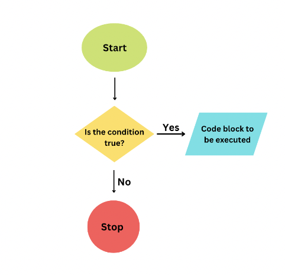
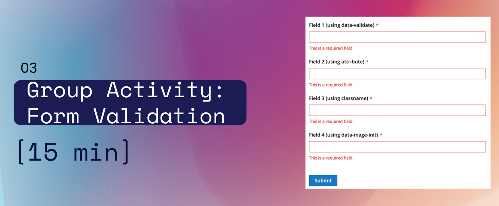

# Loops 🔂

<hr>

🚗 <span style="color:lightgreen">Today's Road Map: 🚗
 - Introduce *For Loops*
 - Examples
 - Combine *Conditionals & Loops* 🌟
 - Introduce *While Loops*
 - Examples
 - Practice time!</span>
 
 <hr>
 <hr>
 <br>

## Sooooo....What is a loop?

- Loops repeat an action based on a condition.
    - <span style="color:lightblue">*example: while you still have dirt on your face, you should keep washing.*</span>
     - <span style="color:lightblue">*example: while the 'repeat song' button is pressed, keep playing the same song.*</span>
- Loops help reduce the amount of code written but add more complexity.

## JavaScript has many different types of loops:
- <span style="color:deeppink">for   👈 </span>
- for/in
- for/of
- <span style="color:deeppink">while   👈 </span>
- do/while
<hr>


## Why do we need loops?
For example: We want to print `hello world` to the console 5 times.

we could:
```js
console.log('hello world')
console.log('hello world')
console.log('hello world')
console.log('hello world')
console.log('hello world')
```
<span style="color:aqua">...buuuuuuut what if we want to print it *50,000* times? 🤯</span>

- For loops are a way to execute the same code block X times, in a scalable way. 
<hr>

# The basics: For Loops
## Structure:

```js
for (expresson 1; expression 2; expression 3) {
    //code to be executed
}
```
Example:

```js
for ( let counter = 0; counter < 5; counter++) {
    console.log('hello world')
}

// this will run 5 times, with counter values 0-4
```


Another way to think about the structure of a `For Loop`:

```js
for (initial expression; condition; increment) {
    //code to be executed
}
```
### <span style="color:aqua">1. Initial Expression</span>
Here's where you <span style="color:deeppink">declare a variable</span> and this is where our for loop will start executing our code. Most of the times you will start with 0, but you can start with any number.

### <span style="color:aqua">2. Condition</span>
Every time your for loop executes your code block (iterates), it first <span style="color:deeppink">checks the condition</span>, if it returns *true*, the for loop will execute your code again and if it returns *false*, it will stop executing the code.

<span style="color:lightgreen">*Careful: if your condition never returns false, it will execute your code forever!!!!*<span>

### <span style="color:aqua">3. Increment</span>
It tells your for loop how much your initial expression will <span style="color:deeppink">increment</span> (or decrement) after each code block execution (iteration).

<br>
Counting sheep with a 'for loop'. 🐑 🐑 🐑

```js
for (let sheepCounted = 0; sheepCounted < 10; sheepCounted++) {
    console.log("I have counted " + sheepCounted + " sheep!")
}
```
<br>
🤔 Question: Why do we only see "I counted 9 sheep!" and not 10? 🤔
<br>
<br>

<hr>



<hr>
<hr>
<br>

## Check for Understanding

```js
for ( let counter = 0; counter < 5; counter++) {
    console.log('hello world')
}

// how would I change this loop to print `hello world` 25 times?
```

```js
let snacks = ['pudding', 'cake', 'chips', 'cookies']

for ( let i = 0; i < snacks.length; i++) {
    console.log('yummy in my tummy!')
}

// what do you expect to see when I run this for loop?
```

🤔 Discussion Q: What are some examples of something you could use a loop for in the real world? 🤔


<br>

<hr>

# Combining Loops and Conditionals 

<hr>

```js
for (?) {
    if (?) {
        console.log('here is a number divisible by 2')
    }
}
```

<strong>Let's make a For Loop that will print out the even numbers between 1 and 10.</strong>

<span style="color:lightblue"> Remember --> The conditional in the 'for loop' determines how many times the loop will run.
The conditional in the 'if statement' determines if the condition is true, and if the code block should be executed.</span>

<br>
<hr>
<br>

# While Loops 🔂
Repeatedly executes its body until the specified condition is no longer true.

*<span style="color:lightgreen">"Keep doing this while this condition is true. Stop doing this if the condition is false."</span>*

```js
while (condition) {
    console.log("do something");
    i++
}
```

Counting sheep with a 'while loop'. 🐑 🐑 🐑

```js
let sheepCounted = 0;

while (sheepCounted < 10) {
    console.log("I have counted " + sheepCounted + " sheep");
    sheepCounted++
}
```

🤔 Why do we need to make sure that inputs in a form are properly formatted? What issues could happen if we don’t check for correct input? 🤔

<br>
<hr>
<br>

## Ok, your turn! 👩‍💻


